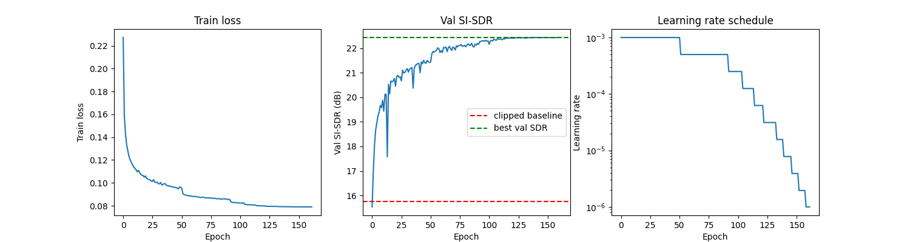
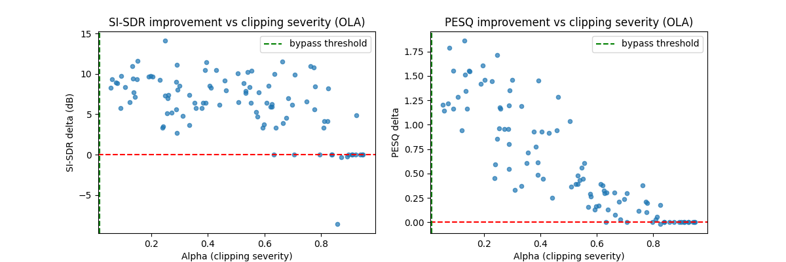
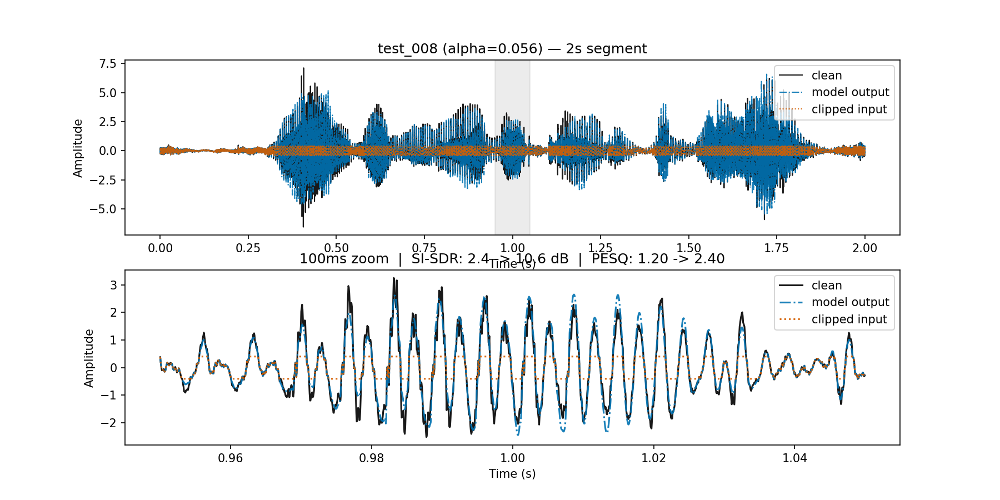

# speech-declipping

Waveform-domain U-Net that restores hard-clipped speech, trained and evaluated on LibriSpeech.

## Highlights

- **+6.25 dB SI-SDR / +0.62 PESQ** over the clipped baseline on held-out test speakers (with routing + overlap-add)
- **~314k parameters** — 1D U-Net (inspired by CleanUNet) with dilated conv bottleneck and self-attention blocks
- **41% smaller** via INT8 quantization (691 → 408 KB) with negligible quality/latency change
- **~0.48 ms/block** inference latency on CoreML (FP32 or INT8) vs ~2.2 ms on PyTorch MPS
- Full pipeline: dataset construction → model training/ablation → export & deployment benchmarking

## Contributions

**Bypass routing** — skip the model entirely on lightly-clipped input:
- Fraction clipped (f_c) used as a cheap proxy for clipping severity per block
- Bypass threshold (ε) determined empirically ([`00_data/00_routing_analysis.ipynb`](00_data/00_routing_analysis.ipynb)) by sampling clipping severities and measuring PESQ MOS as a function of f_c
- At the selected threshold (FC_BYPASS=0.015), 78.4% of test blocks are bypassed, improving SI-SDR by +1.65 dB and PESQ by +0.22 over running every block through the model

**Loss function ablation** — two custom loss terms outperformed standard alternatives ([`01_dnn/01_train_study.ipynb`](01_dnn/01_train_study.ipynb)):
- **Amplitude-weighted L1** — weights the L1 term toward samples near/above the clipping threshold, since untouched (unclipped) samples don't need correction; beat plain L1 by 2.58 dB val SI-SDR (21.25 vs 18.67 dB)
- **Discrete Wavelet Transform (DWT) loss** — replaces a multi-resolution STFT loss (a few discrete, hand-picked window sizes) with a differentiable wavelet-based term that captures spectro-temporal structure across resolutions simultaneously; edged out multi-res STFT (21.93 vs 21.90 dB val SI-SDR) with faster convergence
- Winning combination: `weighted_l1 + dwt_loss`

## Pipeline

| Stage | Folder | Description |
|---|---|---|
| 1. Data | [`00_data/`](00_data/README.md) | Builds and verifies the train/val/test dataset from LibriSpeech, and determines the bypass-routing threshold |
| 2. Model | [`01_dnn/`](01_dnn/README.md) | Defines `DeclipNet`, trains it, ablates loss functions, and evaluates on held-out speakers |
| 3. Deployment | [`02_deployment/`](02_deployment/README.md) | Exports to ONNX/Core ML, attempts pruning, quantizes, and benchmarks latency/quality across runtimes |

## Results Summary

- Test set (100 utterances, 20 held-out talkers), clipped-input SI-SDR baseline: 15.75 dB
  - Without routing: 25.37 dB SI-SDR (+4.30), 3.63 PESQ (+0.31)
  - With routing: 27.02 dB SI-SDR (+5.94), 3.85 PESQ (+0.53)
  - With routing + overlap-add: **27.32 dB SI-SDR (+6.25), 3.95 PESQ (+0.62)**
- Largest gains at low alpha (severe clipping): PESQ +1.18, SI-SDR +7.82 dB







**Audio example** (PESQ 1.69 → 3.55):
- **Clean:** [clean_example.wav](assets/audio/clean_example.wav)
- **Clipped (input):** [clipped_example.wav](assets/audio/clipped_example.wav)
- **Reconstructed (model output):** [reconstructed_example.wav](assets/audio/reconstructed_example.wav)
- Structured channel pruning was not viable at this model size — quality collapsed even at 20% sparsity
- INT8 quantization is a wash on quality/latency at 314k params, but halves model size

See [`01_dnn/README.md`](01_dnn/README.md) for training/ablation details and limitations, and [`02_deployment/README.md`](02_deployment/README.md) for export and benchmarking details.

## References

- CleanUNet (Kong et al., 2022)
- Demucs / Real-Time Speech Enhancement (Défossez et al., 2020)
- DDD (Yi et al., 2024)
- Speech Declipping Transformer (Kwon et al., 2024)
- U-Net Declipper (Kashani et al., 2019)

## Setup

```bash
pip install -r requirements.txt
```

- Python 3.10+ (developed/tested on 3.10 and 3.11)
- `coremltools` (Core ML export/benchmarking) requires macOS
- Notebooks are numbered and intended to be run in order within each folder (see individual READMEs)
- Model artifacts in `02_deployment/models/` are generated by `02_export.ipynb`/`02_benchmark.ipynb`, not hand-committed source
